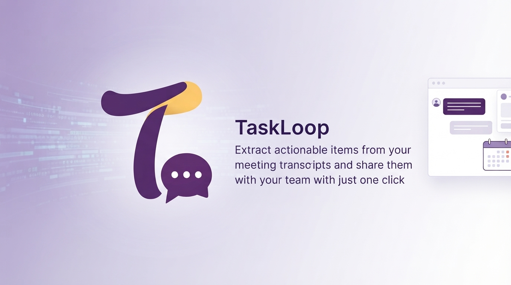

# TaskLoop

**Author:** Bhargavi Kurukunda

**Hackathon:** [Slack Agent Builder Hackathon 2026](https://slackhack.devpost.com/?ref_feature=challenge&ref_medium=your-open-hackathons&ref_content=Submissions+open&_gl=1*e9nsy3*_gcl_au*MjU5OTM3MTc5LjE3ODE5MjQ2MzU.*_ga*NDM1NjA5ODc1LjE3ODE5MjQ2MzU.*_ga_0YHJK3Y10M*czE3ODM4MDU2MDAkbzEzJGcwJHQxNzgzODA1NjAwJGo2MCRsMCRoMA..)

**Submission Track:** New Slack Agent

A Slack app that reads your meeting transcripts and turns them into real, assigned action items — posted right back into the channel, with the right people actually tagged.

## Why I built this

Every meeting ends the same way: someone says "okay, so Alice will do X, Bob will handle Y," and then it just... evaporates. Nobody writes it down. A week later everyone's asking who was supposed to do what.

I wanted something that could read a transcript, figure out who actually committed to what, and post it somewhere everyone can see — without making things up. If it's not sure who "Alex" refers to, it says so instead of guessing and pinging the wrong person.

## Try it

TaskLoop isn't listed in Slack's app directory yet — install it directly here:

**[Add TaskLoop to your workspace](https://slack-follow-up-agent.vercel.app/slack/install)**

Click the link, approve the permissions, and you're set — `/taskloop` will be available right away.

## How it works

You run `/taskloop` in a channel, paste in your transcript, pick the meeting date, and hit submit. From there:

1. Gemini reads the transcript and pulls out action items — who, what, and when — with a source quote attached to each one, so nothing gets invented.
2. Each person's name gets checked against the real workspace using Slack's own MCP server, so the mention is a real, clickable one — not a guess.
3. If a name is ambiguous (two Alex's?) or doesn't match anyone, it says so plainly instead of tagging the wrong person.
4. Everything gets posted back into the channel it came from.

Bigger transcripts run through a queue in the background, so nothing times out even if there's a lot to process.

## Stack

- Flask, deployed on Vercel
- Gemini for extraction
- Slack's official MCP server for user lookups
- Upstash QStash for background processing
- Upstash Redis for storing each workspace's tokens after install

## Install

Any workspace can add TaskLoop — it walks you through Slack's normal OAuth flow and works independently for each team that installs it.

## AI and LLM assistance

- **Claude**: 
    -- Helped me figure out Upstash QStash when I was stuck wondering how to process and deliver longer transcripts and action list since vercel is a serverless deployement with no persistence.
    -- Helped with finding documentations for modal building in slack and slack MCP server tool list.
- **Gemini**: 
    -- Used to generate images (logos, banner)

** As this was a learning project for me, I didn't use tools like Cursor, Claude Code or Codex. If you are here to learn about MCPs and Agent development, I recommend you try to build it yourself from scratch **